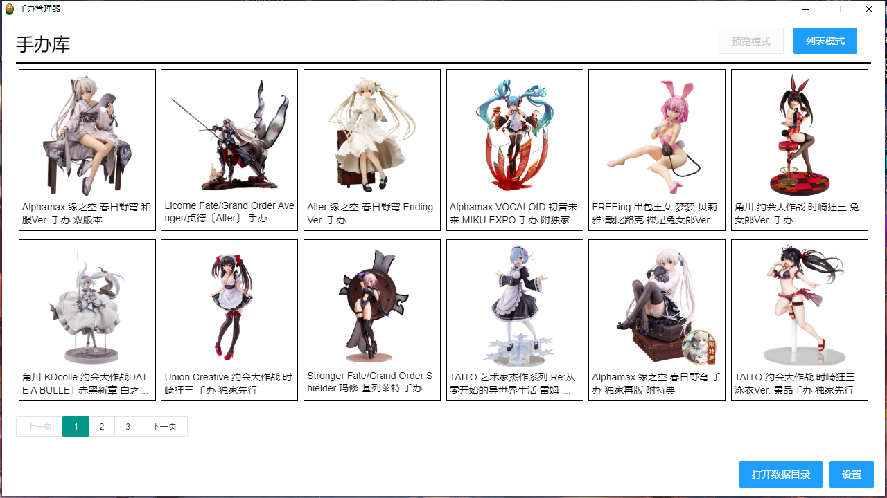
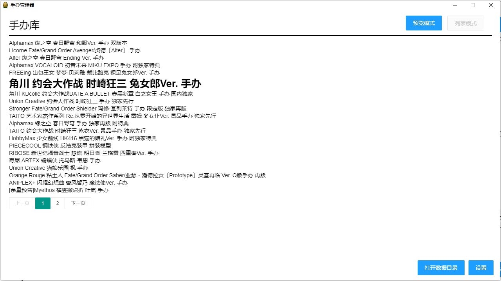
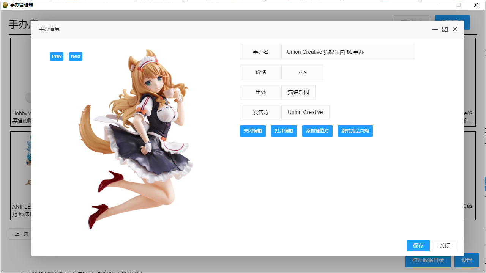
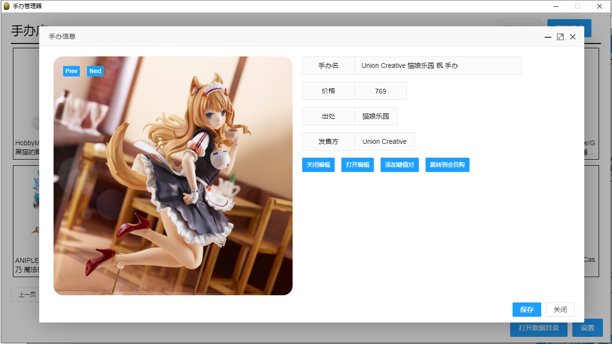
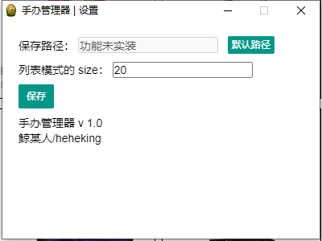
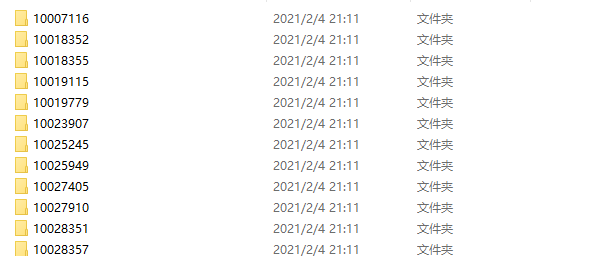
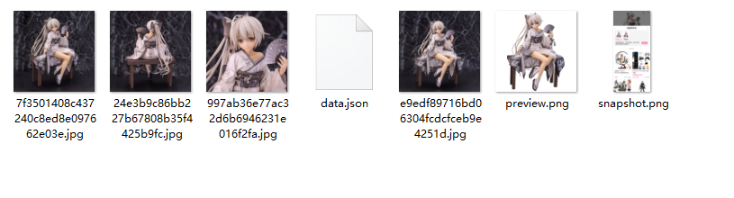

# figureCollection
一个基于 Electron + Vue 实现的 gui 手办查看器，可以欣赏从会员购爬取的手办数据。

## 预览



选中列表模式会变成这样：



点击手办后会这样：



可以对预设的词条做一个编辑，也可以查看爬取的图片列表



简单的做了下设置：



## 配置

### 默认的数据路径

在软件可执行文件同级的 data 文件夹

默认会从 "data/figure/{id}" 中获取手办数据





### 数据格式



打开一个手办文件夹后，会有 `data.json` 和 `preview.png` 和 `snapshot.png` 以及若干图片数据

**data.json**：保存手办的数据，基于 MallGetter v0.2 的数据格式：

```json
{"id": "10007116", "title": "Alphamax 缘之空 春日野穹 和服Ver. 手办 双版本", "ip": "缘之空", "price": "1055-1199", "maker": "Alphamax", "url": "https://mall.bilibili.com/detail.html?noTitleBar=1&from=homepage_actoys#goFrom=na&noReffer=true&itemsId=10007116", "imageList": ["preview.png", "e9edf89716bd06304fcdcfceb9e4251d.jpg", "7f3501408c437240c8ed8e097662e03e.jpg", "24e3b9c86bb227b67808b35f4425b9fc.jpg", "997ab36e77ac32d6b6946231e016f2fa.jpg"]}
```

**preview.png**：手办的封面图，会在预览模式中展示

**snapshot.png**：MallGetter v0.2 爬取数据时会进行一次快照

其他图片数据会被扫描，可以再手办详情页的左侧手动查看

## 下载

下载链接：有空了传到 github 上，下次一定
